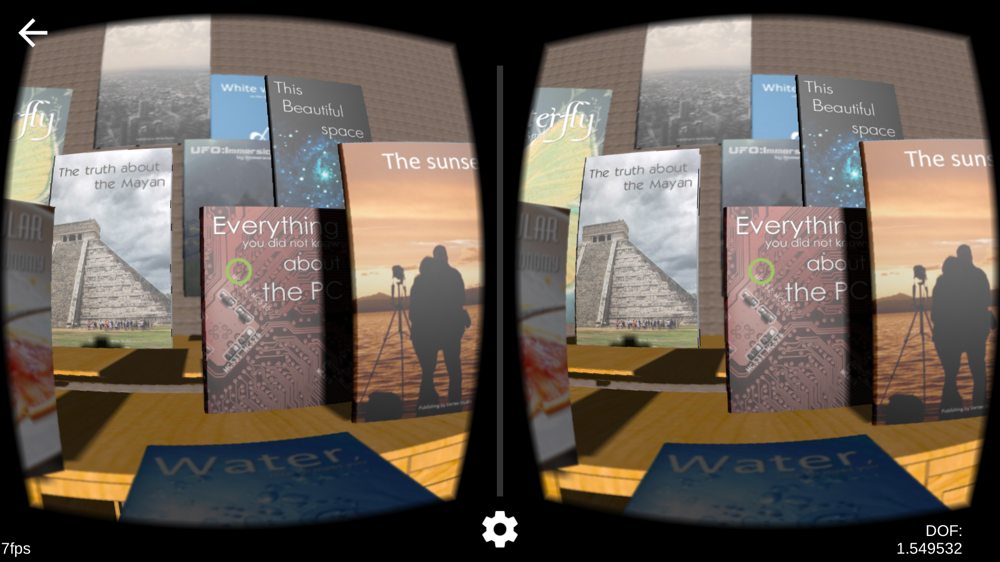
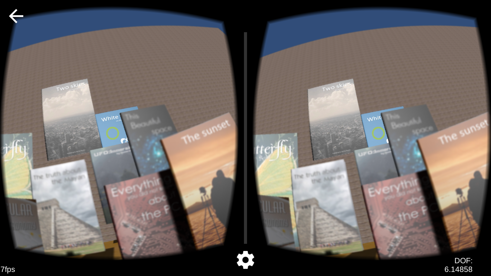

VAC Demo
===
Author: Long Qian

Date: 2016-10-07

## Overview
**Vergence-Accommodation Conflict** is a major issue in virtual reality and augmented reality that causes user fatigue. This application is an example, aiming to provide a straight forward experience of this issue.

## Requirement
### Building
* Unity3D (v5.0+)
* GVR SDK (v0.6)
	* v0.6 contains the Unity3D GameObject of two virtual eyes, which is easier for the integration of ImageEffect. v1.0+ re-organizes the two virtual eyes in scripts.
* Access to Unity3D asset store
	* For the access of object materials and models.
* Android SDK (with API 19+)

### Running
* Android Phone (API 19+)
* Google Cardboard

The Android installation file is ```VAC.apk``` in this repository, in case you are not customizing the application.

I am using Nexus 5 for testing, and the screenshots below are generated by Nexus 5.

## Demonstration
In this application, there are many objects with texture, placed at different depth of the scene, e.g. books, tables. The rectile that shows the user gaze finds the current focused object. The focus depth is adjusted accordingly, achieved by Unity3D ImageEffect script. With different gaze, user experiences the effect of depth blur, which is correspondant to the retinal blur of different depth.

When the focus is close,


When the focus is far,


The right lower corner shows the **current depth of focus (DOF)**.

For more information about vergence-accommodation conflict, visit **[my blog post](https://longqian.me/2016/10/05/vergence-accommodation-conflict-vac/)**.


## Issue
* In order to achieve the effect of focus and defocus, Cardboard undistortion, there are five rendering passes. In general, post rendering is computationally expensive for mobile platforms. In the case of Nexus 5, the frame rate of this application is 7 fps.


## Acknowledgement
* **[Books Pack](https://www.assetstore.unity3d.com/en/#!/content/5484)** assets for the models and materials of books
* **[Free Furniture Set](https://www.assetstore.unity3d.com/en/#!/content/26678)** assets for the models and materials of chairs and tables
* **[Wooden Floor Pack](https://www.assetstore.unity3d.com/en/#!/content/31492)** assets for the materials and texture of wooden floor


